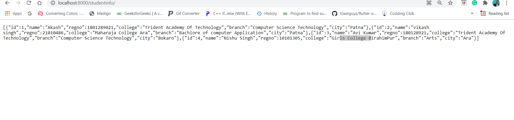
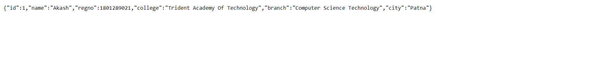
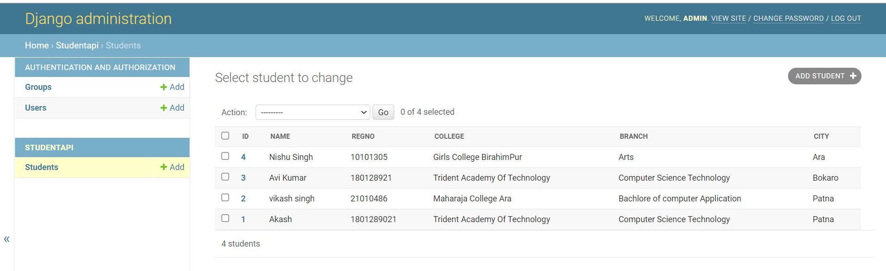

# "CollegeApi" 
An Django Based RestFramework api for colleges

## Getting Started
 Django is a Python-based free and open-source web framework 
  <a href="https://www.django-rest-framework.org/">Start Your journey from here!</a> 
 Also if you like then Don't Forget to give a star!
🌟✨

so if You guys are intrested plese let me know clone it and became a colaborator.

 

 

## Way to help
Find me!
Git clone (using this command or download locally )
and using pip install -r requirement.txt install requirments and run the project using  python manage.py runserver

# Thank You :)❤️❤️
